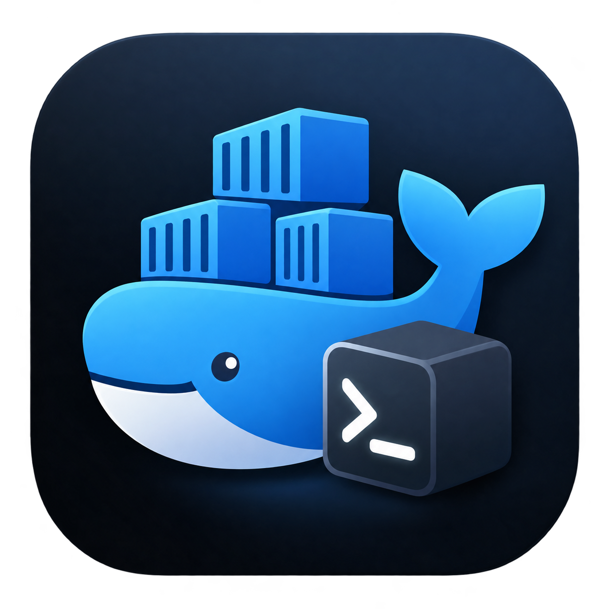

#  ScratchCube

ScratchCube is a desktop Docker manager built with **Avalonia** and **.NET 10**.

It provides a simple interface for managing local Docker resources, with a focus on fast and lightweight workflows.

## ✨ Features

- 📦 View and search Docker containers, images, and volumes
- ▶️ Start, stop, and delete containers
- 🚀 Run containers with:
    - Optional container name
    - Custom command
    - Port mappings
- 🔍 View container inspection details
- 📊 Stream live container statistics
- 📜 Stream live container logs
- ⬇️ Pull Docker images with live progress
- ⚙️ Manage Docker Engine state through `systemctl`
- 🖥️ Minimize the application to the system tray
- 🔄 Periodically refresh Docker data in the background

## 📦 Container Monitoring

From the **Containers** page, select a container to access:

### 🔍 Inspect

View container metadata and configuration similar to:

```bash
docker inspect <container>
```

### 📊 Stats

View live container resource usage, including streaming Docker statistics.

### 📜 Logs

View live container logs as they are produced.

## 🖼️ Docker Images

The **Images** page provides:

- 🔎 Image search
- 📋 Image listing
- 🏷️ Repository tags
- 💾 Image size information
- 📅 Image creation date
- 🗑️ Image deletion
- ⬇️ Pull images with live progress reporting

## 🚀 Run Containers

ScratchCube provides a graphical interface for running Docker containers.

The **Run Container** dialog supports:

- 🖼️ Selecting an existing Docker image
- 🏷️ Setting an optional container name
- ⌨️ Providing an optional command
- 🔌 Configuring port mappings

Example port mapping:

```text
8080:80
```

Multiple mappings can be specified:

```text
8080:80, 8443:443
```

## 💽 Docker Volumes

The **Volumes** page provides access to local Docker volumes.

It supports:

- 📋 Viewing Docker volumes
- 🔎 Searching volumes
- 🗑️ Removing volumes

## ⚙️ Docker Engine

ScratchCube can control the local Docker Engine through `systemctl`.

The application supports:

- ▶️ Starting Docker Engine
- ⏹️ Stopping Docker Engine
- 🔗 Connecting to the Docker daemon
- 🔎 Detecting Docker availability

The current implementation targets systemd-based Linux environments.

## 🖥️ System Tray

ScratchCube can minimize to the system tray and continue running in the background.

The tray menu provides access to:

- 👁️ Show the main window
- ❌ Exit the application

The main window can therefore be hidden without terminating the application.

## 🔄 Automatic Refresh

Docker resources are periodically refreshed in the background.

The application automatically updates:

- 📦 Containers
- 🖼️ Images
- 💽 Volumes

Changes are reflected in the UI without requiring a manual refresh.

## 📸 Screenshots

Screenshots are stored in the `Docs/` folder.


## 🛠️ Tech Stack

- 🟣 **.NET 10** (`net10.0`)
- 🎨 **Avalonia UI 12**
- 🧩 **CommunityToolkit.Mvvm**
- 🐳 **Docker.DotNet**
- 💻 **C#**

## 📋 Prerequisites

- 🐧 Linux desktop environment
- 🔷 .NET 10 SDK
- 🐳 Docker Engine
- 🔌 Access to the Docker socket:
  `/var/run/docker.sock`
- ⚙️ systemd for Docker Engine start/stop functionality

## 🚀 Getting Started

Clone the repository and run the application from the repository root:

```bash
dotnet restore ScratchCube.sln
dotnet run --project ScratchCube/ScratchCube.csproj
```

## 📦 Build Release

To publish a Release build:

```bash
dotnet publish ScratchCube/ScratchCube.csproj -c Release -f net10.0
```

## 🔐 Docker Permissions

ScratchCube communicates with Docker through the Docker socket.

If Docker is installed but access is denied, add your user to the `docker` group:

```bash
sudo usermod -aG docker $USER
```

Then log out and log back in for the group membership to take effect.

> ⚠️ Adding a user to the `docker` group grants privileges equivalent to root access on the Docker host. Use this only when appropriate for your environment.

## ⚙️ Docker Engine Control

ScratchCube uses `systemctl` for Docker Engine start/stop operations.

The implementation expects a systemd-based Linux environment.

Depending on the system configuration, starting or stopping Docker may require elevated privileges.

## 🗂️ Project Layout

```text
ScratchCube/
├── Program.cs
├── App.axaml
├── App.axaml.cs
│
├── Service/
│   ├── DockerService.cs
│   └── DockerInstance.cs
│
├── Models/
│   └── Docker/
│
├── ViewModels/
│   ├── Pages/
│   └── Windows/
│
└── Views/
    ├── Pages/
    ├── Windows/
    └── Controls/
```

### 📁 Important Files

| File | Description |
|---|---|
| `ScratchCube/Program.cs` | 🚀 Application entry point |
| `ScratchCube/App.axaml` | 🖥️ Application resources and system tray configuration |
| `ScratchCube/App.axaml.cs` | 🔄 Application lifetime and tray/window handling |
| `ScratchCube/Service/DockerService.cs` | ⚙️ High-level Docker orchestration |
| `ScratchCube/Service/DockerInstance.cs` | 🐳 Docker client and Docker API operations |
| `ScratchCube/ViewModels/Pages/` | 🧩 Page-level view models |
| `ScratchCube/Views/` | 🎨 Avalonia views and controls |
| `ScratchCube/Models/Docker/` | 📦 Docker data models |


Before running the script, verify that the project and output paths referenced by the script match the current repository structure.

## 📄 License

Add the project's license information here if a license has been selected.