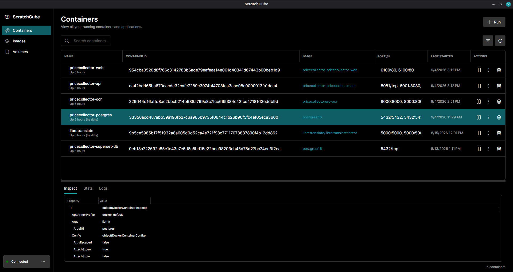
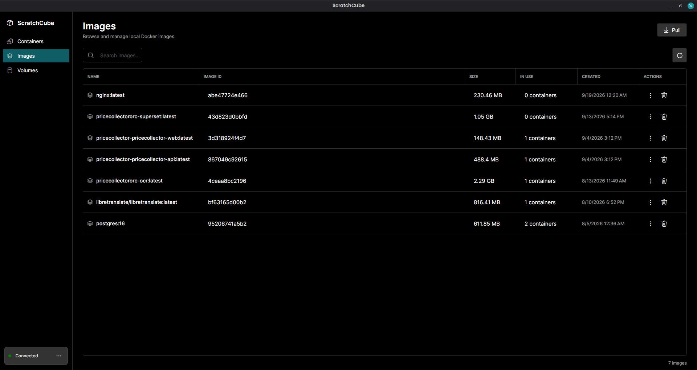
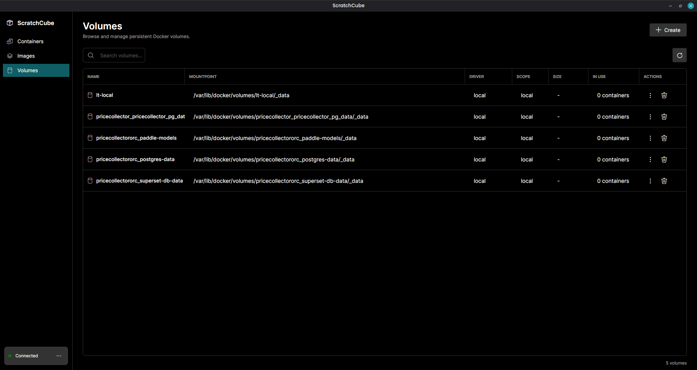

# ScratchCube

ScratchCube is a desktop Docker manager built with Avalonia and .NET.

It focuses on fast, local Docker workflows with a simple UI for:
- Containers
- Images
- Volumes

## Features

- View and search containers, images, and volumes
- Start, stop, and delete containers
- View container inspect details (`docker inspect` style)
- Stream live container stats and logs
- Pull images with progress
- Run containers with optional name, command, and port mappings
- Minimize to system tray
- Auto-refresh Docker data (periodic background refresh)

## Container Monitoring

From the **Containers** page, select a container to access:
- Inspect view (container metadata/configuration)
- Stats view (live resource usage stream)
- Logs view (live log stream)

## Screenshots

Screenshots are stored in the `Docs/` folder.





## Tech Stack

- .NET 10 (`net10.0`)
- Avalonia UI 12
- CommunityToolkit.Mvvm
- Docker.DotNet

## Prerequisites

- Linux desktop environment (current implementation is Linux-first)
- .NET 10 SDK
- Docker Engine
- Access to Docker socket (`/var/run/docker.sock`)

## Getting Started

From the repository root:

```bash
dotnet restore ScratchCube.sln
dotnet run --project ScratchCube/ScratchCube.csproj
```

## Build Release

```bash
dotnet publish ScratchCube/ScratchCube.csproj -c Release -f net10.0
```

## Notes on Docker Engine Control

The app includes start/stop actions for Docker Engine via `systemctl`.

- This expects a systemd-based Linux environment.
- Depending on your setup, starting/stopping Docker may require elevated privileges.
- If Docker is installed but permission is denied, add your user to the `docker` group and re-login.

## Project Layout

- `ScratchCube/Program.cs` - app entry point
- `ScratchCube/App.axaml` - app resources and tray menu
- `ScratchCube/Service/DockerService.cs` - high-level Docker orchestration
- `ScratchCube/Service/DockerInstance.cs` - Docker client operations
- `ScratchCube/ViewModels/Pages/` - Containers, Images, Volumes page view models
- `ScratchCube/Views/` - Avalonia views

## Packaging Script

A Linux AppImage script exists at `ScratchCube/build_linux_x86.sh`.

If you use it, verify project/file names inside the script match the current project files before running.

